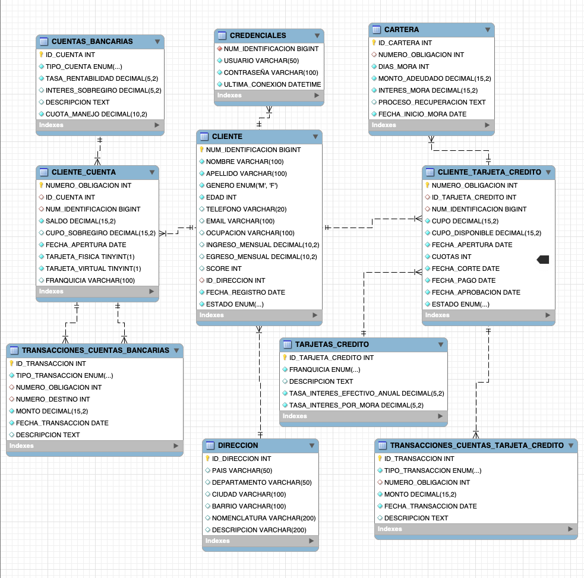

# Banco Digital - Gestión base de datos BankTech

Una base de datos optimizada para la gestión de cuentas, productos, transacciones y cartera en una aplicación de banca digital.

Este repositorio contiene toda la estructura utilizada para crear la base de datos para una aplicación de banco digital, diseñada para acceder a la información y gestionarla de manera eficiente.

## Tabla de Contenidos

1. [Descripción](#descripción)
2. [Tecnologías Utilizadas](#tecnologías-utilizadas)
3. [Esquema de Base de Datos](#esquema-de-base-de-datos)
4. [Tablero de analisis](#tablero-de-analisis)

---

## Descripción

La base de datos ha sido desarrollada para proporcionar la infraestructura de datos esencial para una aplicación de banca digital, permitiendo la gestión eficiente de los clientes, productos financieros, transacciones y cartera. Incluye tablas normalizadas y relaciones para asegurar integridad referencial y optimizar consultas de alto rendimiento.

## Tecnologías Utilizadas

-  - Sistema de gestión de base de datos relacional.
-  - Población de datos y creación de interfaz cliente y administrador.
-  - Herramienta para realizar y gestionar migraciones de bases de datos en Python.

## Esquema de Base de Datos

### Diagrama Relacional

> 

- **Clientes**: Información personal y de contacto del usuario.
- **Cuentas Bancarias**: Datos relacionados con cada cuenta bancaria.
- **Transacciones**: Registro de todas las transacciones realizadas.
- **Productos**: Información sobre los productos financieros ofrecidos.

## Tablero de analisis

El tablero de analisis creado, cuenta con vistas de cliente, productos y cartera, que permiten visualizar y firltrar la información, para conocer indicadores de importancia para diagnosticar el estado de la aplicación en diferentes areas de interés.

> [Analisis de datos BankTech](https://app.powerbi.com/view?r=eyJrIjoiMTc5MWZmMzUtNzY4MS00MDAwLWI4ZjUtZWQ2NmFlN2VkMTU4IiwidCI6IjU3N2ZjMWQ4LTA5MjItNDU4ZS04N2JmLWVjNGY0NTVlYjYwMCIsImMiOjR9&pageName=9ea71799499533a74817)
